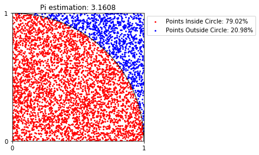

# Vypocitaj PI

π môžeme odhadnúť s pomocou náhodných čísel. Náhodne vygenerované body v 2D priestore môžeme použiť na odhad obsahu kruhu. Tento odhad môžeme potom použiť na odhad hodnoty π.

Nám stačí pracovať s takýmto štvrť-kruhom.




Takže π môžeme odhadnuť jednoduchou rovnicou:


## Postup
1. Vo štvorci s dĺžkou 1 vygenerujeme náhodný bod (x, y).
2. Skontrolujeme, čí sa daný bod nachádza v kruhu alebo mimo s pomocou podmienky `x*x + y*y < 1`
3. Postup opakujeme veľa krát, do jednej premennej si zasnamenávame koľko bodov bolo v kruhu.
4. Nakonie použíjeme rovnicu hore a do výstupu napíšeme náš odhad π.

## Špecifikácia input/output
```sh
$ ./vypocitaj_pi.exe
Prosim, zadaj pocet vygenerovanych bodov
./vypocitaj_pi.exe <pocet bodov>

$ ./vypocitaj_pi.exe 10
odhad pi je 3.600000

$ ./vypocitaj_pi.exe 1000
odhad pi je 3.156000

$ ./vypocitaj_pi.exe 100000
odhad pi je 3.154600

$ ./vypocitaj_pi.exe 100000000
odhad pi je 3.141536
```